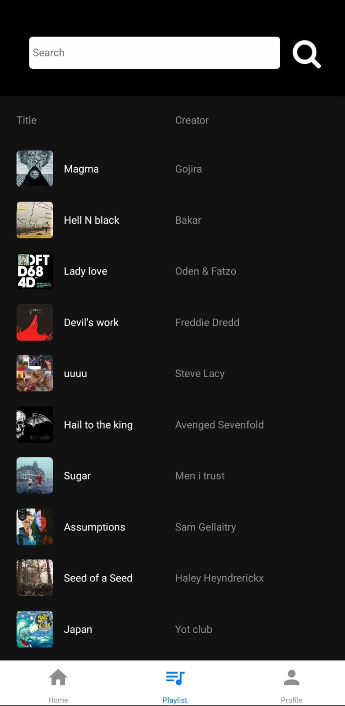

# expo navbar example
Exemplo de utilização do expo navbar

## Requisitos:
- Android Studio
- npm

## Como rodar:
1. Clone o repositorio
2. Abra a pasta do repositorio
3. npm install
4. npm run android

## Previews: 
### Home

### Playlist

### Profile

